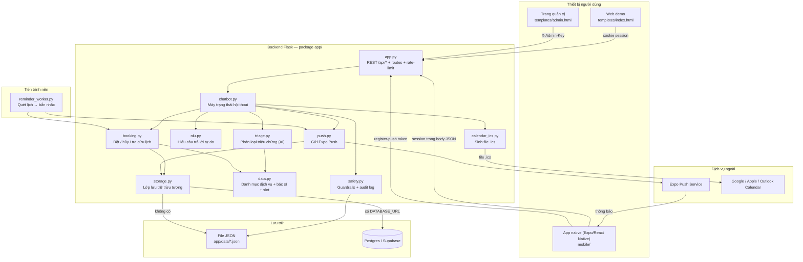
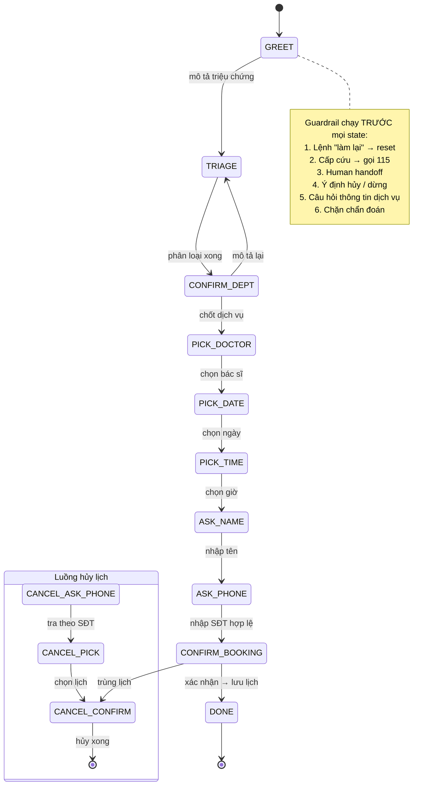
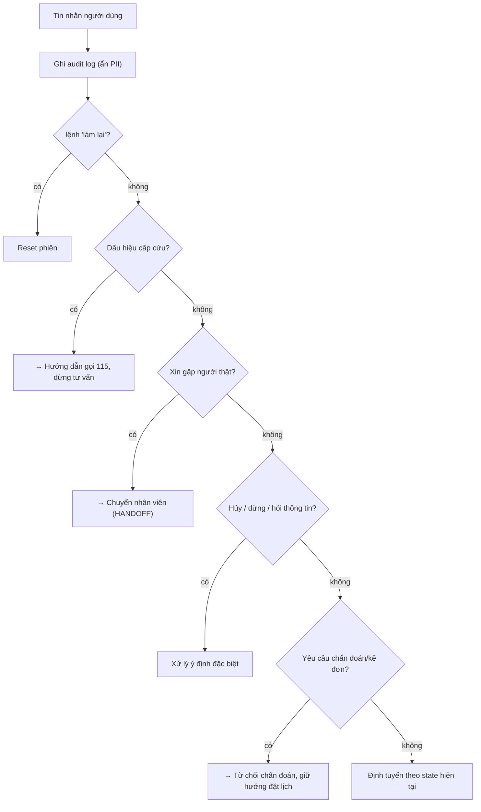
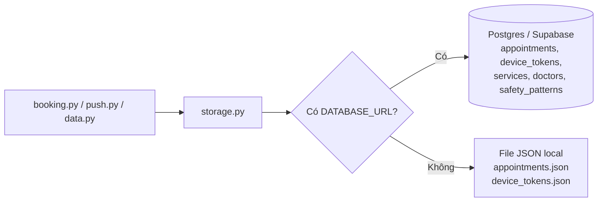
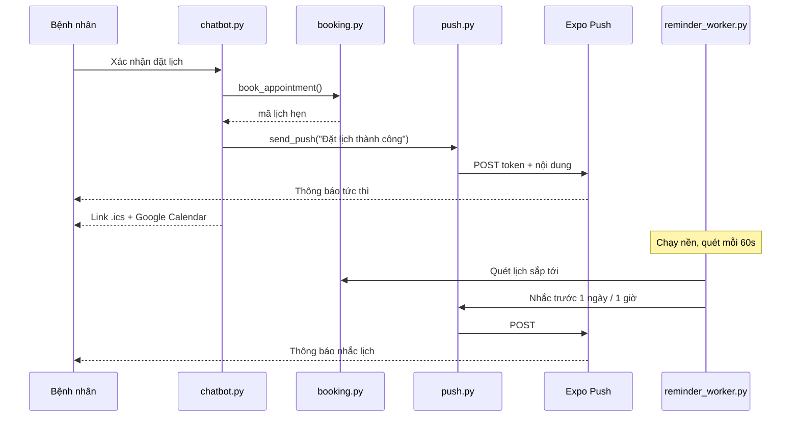
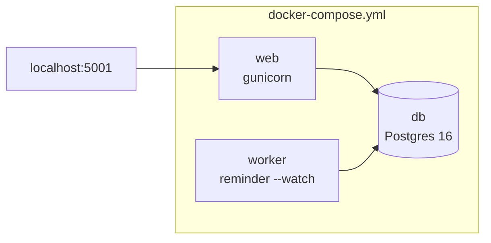

# Kiến trúc hệ thống — Trợ lý Nha khoa SHI

Tài liệu này mô tả **kiến trúc tổng thể** của dự án: các thành phần, luồng dữ
liệu, mô hình trạng thái hội thoại, lớp lưu trữ, guardrail an toàn và cách hệ
thống mở rộng lên production. Đọc kèm [README.md](README.md) (hướng dẫn cài đặt/chạy)
và [DATABASE.md](DATABASE.md) (chi tiết Supabase).

---

## 1. Tổng quan

**SHI** là chatbot tiếng Việt cho **một phòng khám nha khoa**. Bệnh nhân mô tả
triệu chứng răng miệng → hệ thống **phân loại (triage)** vào đúng nhóm dịch vụ →
dẫn dắt **đặt lịch** với bác sĩ phù hợp → **nhắc lịch** qua push notification và
file `.ics`.

Đây là đề tài demo (PRF/SHI) nên đi kèm **hệ thống đánh giá AI** (Precision /
Recall / F1, so sánh 2 phiên bản triage) trong thư mục [eval/](eval/).

**Nguyên tắc thiết kế cốt lõi:**

| Nguyên tắc | Thể hiện trong code |
|-----------|---------------------|
| Chạy được ngay, không cần API key | Triage rule-based làm nền; push qua Expo (miễn phí); `.ics` không cần OAuth |
| Tách nghiệp vụ khỏi hạ tầng | `storage.py` là lớp trừu tượng; đổi JSON ↔ Postgres không sửa `booking.py`/`push.py` |
| An toàn y tế lên trước | `safety.py` chặn cấp cứu/chẩn đoán/PII với ưu tiên cao nhất trong máy trạng thái |
| LLM là nâng cấp, không phải phụ thuộc | `triage.classify_with_llm()` chạy khi có API key; lỗi/timeout tự rơi về rule-based v2 |
| DB là nguồn chân lý duy nhất | Không cache slot in-memory; kiểm tra khung giờ trống trực tiếp tại bước xác nhận |

---

## 2. Sơ đồ thành phần cấp cao



---

## 3. Hai phần chính & giao tiếp

Hệ thống gồm **backend Flask** và **app native**, nối nhau qua **REST JSON**.

```
┌─────────────────────┐      HTTP /api/*      ┌──────────────────────────┐
│  App native (Expo)  │  ───────────────────► │  Backend Flask (app/)    │
│  mobile/  (RN UI)   │  ◄─── push token ──── │  triage · booking · safe │
└─────────────────────┘                       └────────────┬─────────────┘
        ▲   push notification (Expo Push)                   │
        └───────────────────────────────────────────────────┘
                       app/reminder_worker.py (nhắc lịch)
```

- **Web** dùng **cookie session** (Flask `session["sid"]`).
- **App native** không có cookie → gửi `session` (uuid4-hex 32 ký tự) trong body
  JSON mỗi request. Xem `resolve_sid()` trong [app/app.py](app/app.py).
- App native phải **cùng mạng Wi-Fi** với backend vì `mobile/src/config.js`
  (`API_BASE`) trỏ vào **IP LAN**. Khi deploy thật phải đổi sang URL HTTPS công khai.

---

## 4. Thành phần backend (`app/`)

| Module | Trách nhiệm | Ghi chú kiến trúc |
|--------|-------------|-------------------|
| `app.py` | Flask app, routes public + admin, rate-limit, phân giải session | Rate-limit 30 req/60s theo IP (chỉ `/api/*`); giới hạn body 64KB |
| `chatbot.py` | **Máy trạng thái** hội thoại; session in-memory (`SESSIONS`) | Nguồn điều phối trung tâm; gọi mọi module khác |
| `triage.py` | Phân loại triệu chứng → nhóm dịch vụ (**hàm lượng AI**) | 3 engine v1/v2/llm cùng định dạng kết quả; llm lỗi → fallback v2 |
| `llm.py` | Cổng ra LLM duy nhất (OpenRouter, giao thức OpenAI) | Chỉ dùng `urllib` chuẩn; không bao giờ ném exception ra ngoài |
| `nlu.py` | Hiểu câu trả lời tự do ở bước đặt lịch (ngày/giờ/tên bác sĩ/ý định) | So khớp không phân biệt dấu |
| `safety.py` | Guardrails (cấp cứu, chẩn đoán, PII, handoff) + audit log | Ưu tiên cao nhất trong luồng xử lý |
| `booking.py` | Đặt / hủy / tra cứu lịch, tính khung giờ trống | Gọi qua `storage.py`; DB là nguồn chân lý |
| `data.py` | Danh mục dịch vụ (`DEPARTMENTS`), bác sĩ (`DOCTORS`), khung giờ | Seed tĩnh; nạp từ DB nếu có `DATABASE_URL` |
| `storage.py` | **Lớp lưu trữ trừu tượng** JSON ↔ Postgres | Chọn backend theo `DATABASE_URL` |
| `push.py` | Gửi push qua Expo Push Service | Không token → ghi outbox JSONL |
| `reminder_worker.py` | Quét lịch → bắn nhắc (nền/cron) | Tiến trình riêng, dùng chung `booking`+`push` |
| `calendar_ics.py` | Sinh file `.ics` (có VALARM 2 lời nhắc) | Không cần OAuth |
| `templates/` | Web demo (`index.html`) + trang quản trị (`admin.html`) | |

### Quy ước "khoa" = "nhóm dịch vụ"

Biến `DEPARTMENTS` / `DOCTORS` giữ tên gốc để **ổn định data contract** với
`booking` và mobile, nhưng về nghiệp vụ đây là **9 nhóm dịch vụ nha khoa** trong
cùng một phòng khám (sâu răng, nội nha, nha chu, chỉnh nha, khám tổng quát...),
không phải 8 chuyên khoa đa khoa như phiên bản trước.

---

## 5. Luồng hội thoại — máy trạng thái

`chatbot.py` là **máy trạng thái hữu hạn**. Mỗi session giữ một `state`; mỗi tin
nhắn được định tuyến theo `state` hiện tại. Trước khi định tuyến, **guardrail an
toàn được kiểm tra trước** (thứ tự ưu tiên giảm dần).



**Đặc điểm quan trọng:**

- **Trả lời linh hoạt** (`_flex_intent`): ở các bước `PICK_*`, người dùng có thể
  "quay lại", "đổi bước", hỏi thông tin dịch vụ, hoặc mô tả triệu chứng mới —
  không bị bắt buộc bấm đúng nút.
- **Đổi dịch vụ giữa chừng** (`_maybe_new_symptom`): mô tả triệu chứng mới trong
  lúc đặt lịch → đề nghị đổi sang dịch vụ phù hợp hơn.
- **Xử lý trùng lịch**: đặt trúng khung giờ đã có → mời hủy lịch cũ rồi đặt lại
  (`resume_booking`).
- **State `GREET` phòng thủ**: nếu session mất (restart / hết TTL / rơi vào worker
  khác) mà người dùng đã gõ triệu chứng, hệ thống triage luôn thay vì nuốt tin nhắn.

---

## 6. Triage engine — "hàm lượng AI"

`triage.py` là điểm nhấn AI của đề tài: **phân loại triệu chứng tiếng Việt →
nhóm dịch vụ** bằng **rule-based scoring** theo từ khóa (khớp theo ranh giới từ).

Có **ba engine**, dùng chung một định dạng kết quả nên thay nhau được và so sánh
được khi đánh giá:

| Engine | Cách hoạt động | Vai trò |
|--------|----------------|---------|
| **v1** | Khớp từ khóa trên văn bản viết thường (có dấu) | Bản gốc, để so sánh |
| **v2** | Khớp không phân biệt dấu (accent-insensitive) | **Nền + fallback** — bắt được cả khi gõ thiếu dấu |
| **llm** | Gọi mô hình ngôn ngữ qua OpenRouter (`app/llm.py`) | **Mặc định khi có `OPENROUTER_API_KEY`** — hiểu ngữ nghĩa, không cần trúng từ khóa |

`default_version()` chọn engine theo môi trường: có API key → `llm`, không → `v2`.

`classify_symptoms()` trả về danh sách dịch vụ ứng viên kèm điểm; `confidence_level()`
quy về `high` / `medium` / `low` để `chatbot.py` quyết định: tự chốt, đưa 2-3 lựa
chọn, hay hỏi lại. `negated_matches()` xử lý phủ định ("tôi **không** bị đau răng")
và **luôn chạy bằng luật** — chỗ này cần biết người dùng đã *nhắc tới* dịch vụ nào,
mà LLM thì cố tình không trả về nhãn bị phủ định.

**Engine LLM (`classify_with_llm()`)** gửi model danh mục dịch vụ + ràng buộc
(chỉ chọn mã có thật, không chẩn đoán, không kê đơn, tôn trọng phủ định) và bắt
trả JSON. Ba lớp bảo vệ:

1. **Không bịa nhãn** — mã nào không có trong `DEPARTMENTS` bị loại.
2. **Fallback im lặng** — mất mạng / timeout / hết credit / JSON hỏng → trả `None`
   → `classify_symptoms()` tự chấm lại bằng v2. Phân biệt rõ `[]` (model khẳng
   định "không có dịch vụ nào phù hợp") với `None` (không gọi được model).
3. **Cache theo câu** — một lượt chat gọi `classify_symptoms()` 2–3 lần cho cùng
   câu; cache khiến chỉ tốn 1 lượt API.

Đo hiệu quả: `python eval/evaluate.py --llm` (mục 7 của `eval/results.md`).

---

## 7. Lớp an toàn (safety guardrails)

`safety.py` là yếu tố phân biệt chatbot y tế thật với bot thường. Chạy với **ưu
tiên cao nhất** trong `handle_message`:



- **Input guardrail**: `mask_pii()` ẩn số điện thoại / email / CCCD trước khi ghi
  audit log; `check_emergency()` phát hiện dấu hiệu nguy hiểm.
- **Output guardrail**: bot **không bao giờ** chẩn đoán / kê đơn; luôn kèm
  disclaimer (`add_disclaimer`).
- **Audit log**: ghi toàn bộ hội thoại (đã ẩn PII) vào
  `app/data/audit_log.jsonl` — tuân thủ **Nghị định 13/2023** về bảo vệ dữ liệu
  cá nhân. Xoay vòng ở 5MB.
- Bộ pattern guardrail có seed tĩnh trong code; nếu có DB thì nạp thêm từ bảng
  `safety_patterns` (nhưng seed tĩnh đảm bảo guardrail **không bao giờ trống**).

---

## 8. Lớp lưu trữ (storage layer)

`storage.py` tách nghiệp vụ khỏi nơi cất dữ liệu. **Chọn backend theo biến môi
trường** `DATABASE_URL`:



| | JSON mode (mặc định) | Postgres/Supabase mode |
|--|----------------------|------------------------|
| Kích hoạt | không đặt `DATABASE_URL` | đặt `DATABASE_URL` |
| Bền vững | mất khi xóa file | bền vững, quản lý online |
| Chống trùng khung giờ | kiểm tra thủ công + `_JSON_LOCK` (1 process) | `UNIQUE INDEX ux_appointments_doctor_slot` |
| Ghi an toàn | atomic (`os.replace` từ file tạm) | transaction |
| Phù hợp | demo, chạy eval | production, nhiều worker |

**Chi tiết đáng chú ý:**

- Khóa unique theo `(doctor_id, date, time)` **không phải** `(date, time)` — hai
  bác sĩ khác nhau vẫn đặt được cùng giờ; chỉ chặn trùng giờ cùng một bác sĩ.
- `prepare_threshold=None` khi connect: tắt auto-prepare của psycopg3 để tương
  thích **Supabase transaction pooler** (cổng 6543, không giữ session giữa các
  transaction).
- Schema tự tạo (idempotent) qua `init_schema()` với double-checked locking.
- Migrate dữ liệu JSON → Postgres bằng [scripts/migrate_to_supabase.py](scripts/migrate_to_supabase.py).

---

## 9. Nhắc lịch & tích hợp lịch

Sau khi đặt lịch thành công, bệnh nhân được nhắc qua **ba kênh độc lập** (không
kênh nào cần OAuth/API key phía người dùng):



1. **Push notification** (Expo Push Service) — tức thì khi đặt/hủy + nhắc theo
   lịch qua `reminder_worker.py`. Mỗi loại nhắc gửi đúng 1 lần (`reminders_sent`).
   Không có token → ghi `app/data/outbox/push_outbox.jsonl` để vẫn test được.
2. **File `.ics`** (`calendar_ics.py`) — thêm vào Lịch iPhone/Mac, Outlook, Google;
   kèm 2 VALARM (trước 1 ngày & 1 giờ). Route `/api/ics/<code>`, chỉ chủ session
   tải được (chống enumeration → luôn 404 nếu không có quyền).
3. **Link Google Calendar** — mở sẵn form tạo sự kiện trên web.

`reminder_worker.py` chạy độc lập backend: `--once` (cron), `--watch` (nền 60s),
`--test` (gửi thử ngay). Trong Docker Compose là service `worker` riêng.

---

## 10. API endpoints

| Method | Path | Việc | Bảo vệ |
|--------|------|------|--------|
| GET | `/` | Web demo | — |
| POST | `/api/start` | Bắt đầu phiên, trả `session` | rate-limit |
| POST | `/api/chat` | Gửi `message`, nhận phản hồi bot | rate-limit |
| POST | `/api/register-push` | App native gửi Expo token | rate-limit |
| GET | `/api/ics/<code>` | Tải file `.ics` của 1 lịch hẹn | chủ session |
| GET | `/admin` | Trang quản trị | — |
| GET | `/api/admin/appointments` | Danh sách lịch hẹn | `X-Admin-Key` |
| GET | `/api/admin/schedule` | Lịch làm việc bác sĩ | `X-Admin-Key` |
| GET | `/api/admin/meta` | Metadata phòng khám | `X-Admin-Key` |
| POST | `/api/admin/cancel` | Hủy lịch hẹn | `X-Admin-Key` |

**Bảo vệ ở tầng API** (`app.py`):
- Rate-limit 30 req/60s theo IP (LRU-cap 5000 IP), chỉ áp dụng `/api/*`.
- Body giới hạn 64KB (chống DoS).
- Session id client gửi phải đúng định dạng uuid4-hex (chống session cố định).
- Admin key **chỉ qua header** `X-Admin-Key` (query string bị log lại); nếu còn
  key demo mặc định thì chỉ chấp nhận từ localhost.

---

## 11. Mô hình đồng thời (concurrency)

Thiết kế hiện tại theo giả định **một process**:

- `SESSIONS` (hội thoại) là **dict in-memory** với `OrderedDict` LRU (trần 2000
  session, TTL 1 giờ). Mỗi session có `threading.Lock` riêng để nối tiếp các
  request cùng phiên.
- `_JSON_LOCK` trong `storage.py` bảo vệ đọc-sửa-ghi file JSON **trong 1 process**.
- Rate-limit buckets cũng in-memory (`OrderedDict` LRU 5000 IP).

**Khi scale nhiều worker** (gunicorn nhiều process, nhiều máy):
- Session hội thoại phải chuyển sang **Redis/DB** (bỏ field `_lock` không
  serialize được, tái tạo Lock khi đọc lại — đã ghi chú sẵn trong `_new_session`).
- Chống trùng lịch chuyển hẳn về **UNIQUE INDEX ở Postgres** (đã có), không dựa
  `_JSON_LOCK`.

---

## 12. Triển khai (deployment)

### Local (dev)
```
Flask dev server (app.py, debug=True, port 5001)  +  reminder_worker --watch
Lưu trữ: file JSON  (hoặc Supabase nếu đặt DATABASE_URL)
```

### Docker Compose (3 service)


- `web` — gunicorn (image `python:3.11-slim`, chạy non-root).
- `worker` — `reminder_worker.py --watch`.
- `db` — Postgres 16 local (có thể thay bằng Supabase: đổi `DATABASE_URL`, bỏ
  service `db`).

### Biến môi trường then chốt
| Biến | Vai trò | Production |
|------|---------|-----------|
| `DATABASE_URL` | Postgres/Supabase; trống → JSON local | nên đặt |
| `SECRET_KEY` | Khóa Flask session | **bắt buộc** chuỗi ngẫu nhiên |
| `ADMIN_KEY` | Khóa `/api/admin/*` | **bắt buộc** đổi khỏi demo |

---

## 13. Đánh giá hệ thống AI (`eval/`)

Đề tài yêu cầu đánh giá định lượng chất lượng triage:

- Datasets gán nhãn: `dataset.jsonl`, `dataset_complex.jsonl`,
  `dataset_negation.jsonl`, `dataset_heldout.jsonl`.
- `evaluate.py` chạy triage engine trên dataset → tính **Accuracy / Precision /
  Recall / Macro-F1** cho **cả v1 và v2**, in kết quả và ghi bảng vào `results.md`.
- Kết quả dùng để so sánh 2 phiên bản và chọn bản tốt nhất (v2 không phân biệt
  dấu thắng nhờ bắt được tiếng Việt gõ thiếu dấu). Xem `BAOCAO_DANHGIA.md`.

---

## 14. Khoảng trống trước production

1. **Dev server** → chuyển sang gunicorn, tắt `debug`.
2. **Session in-memory** → Redis/DB khi chạy nhiều worker.
3. **CORS** chưa cấu hình — cần thêm khi web client khác origin.
4. **`API_BASE`** đang là IP LAN — deploy phải đổi sang URL HTTPS công khai.
5. **Xác thực admin** hiện chỉ là 1 khóa tĩnh — production nên thay bằng đăng
   nhập thật + phân vai trò.

## 15. Hướng nâng cấp (ngoài phạm vi demo)

- Tinh chỉnh prompt / thử model mạnh hơn cho `triage.classify_with_llm()` (đổi
  `LLM_MODEL`), và gọi LLM song song trong `eval/` để rút ngắn thời gian chấm.
- Đồng bộ 2 chiều **Google Calendar** (OAuth) để chặn trùng lịch phía bác sĩ.
