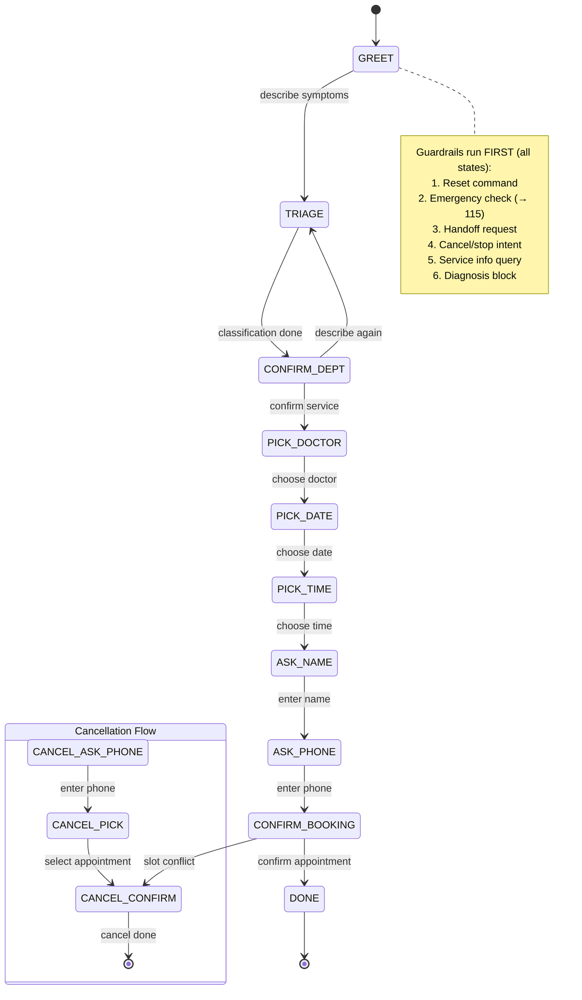
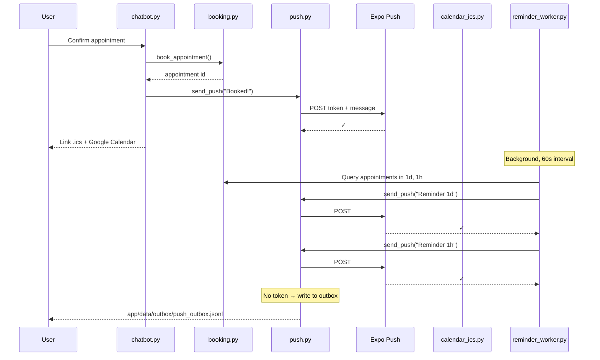

# System Architecture

## High-Level Overview

SHI is a two-tier system: **Backend** (Flask) and **Frontend** (React Native + minimal web demo), communicating via REST JSON.

```
┌─────────────────────────────────────────────────────────────────┐
│                        Users                                    │
├──────────────────┬──────────────────────────────────────────────┤
│   Web/Desktop    │          Mobile (iOS/Android)                 │
│  (index.html)    │        (Expo, React Native)                   │
│  (localhost)     │        (LAN IP via config.js)                 │
└────────┬─────────┴──────────────────────────────────┬────────────┘
         │                                            │
         │   HTTP /api/* (JSON, session in body)    │
         ▼                                            ▼
┌─────────────────────────────────────────────────────────────────┐
│                      Backend (Flask)                             │
│  ┌──────────────────────────────────────────────────────────┐  │
│  │ State Machine (chatbot/router.py)                        │  │
│  │ ├─ GREET → TRIAGE → CONFIRM_DEPT → PICK_DOCTOR         │  │
│  │ ├─ PICK_DATE → PICK_TIME → ASK_NAME → ASK_PHONE        │  │
│  │ ├─ CONFIRM_BOOKING → DONE                               │  │
│  │ └─ Cancel flow: CANCEL_ASK_PHONE → CANCEL_PICK → ...   │  │
│  └────────┬─────────────────────────────────────────────────┘  │
│           ▼                                                      │
│  ┌──────────────────────────────────────────────────────────┐  │
│  │ Business Logic Modules                                   │  │
│  ├─ core/auth.py (JWT, bcrypt password hashing)          │  │
│  ├─ triage/engine.py (v1/v2/llm engines)                  │  │
│  ├─ booking/service.py (slot management)                  │  │
│  ├─ notify/push.py (Expo integration)                     │  │
│  ├─ triage/safety.py (guardrails + audit log)             │  │
│  ├─ admin_api.py (admin endpoints, JWT-gated)             │  │
│  ├─ doctor_api.py (doctor endpoints, JWT-gated)           │  │
│  └─ core/* (auth, storage, catalog, text utilities)       │  │
│  └─────────────────┬──────────────────────────────────────┘  │
│                    ▼                                            │
│  ┌──────────────────────────────────────────────────────────┐  │
│  │ Storage Layer (core/storage.py)                         │  │
│  │ ├─ JSON mode (app/data/*)                               │  │
│  │ └─ Postgres/Supabase mode (DATABASE_URL)                │  │
│  └──────────────────────────────────────────────────────────┘  │
└─────────────────────────────────────────────────────────────────┘
         ▲                                            ▲
         │                        ┌──────────────────┘
         │                        │
    File JSON              Postgres 16
    (local)                (Supabase)

         ▲                                            ▲
         │                        ┌──────────────────┘
         └────────────────────────────────────────────
     External Services
     └─ Expo Push Service (push notifications)
     └─ OpenRouter (LLM, optional)
```

---

## State Machine

The chatbot follows a **finite state machine** with 10 states and two entry flows (standard booking + cancellation).



**Key features:**

- **Flexible flow:** Users can ask for service info, backtrack, or add symptoms anytime (handled in `chatbot/flex.py`).
- **Guardrail override:** Safety checks run before state handlers (not after).
- **Conflict recovery:** If slot is taken, offer to cancel the old appointment and rebook.

---

## Safety Guardrails (Flowchart)

```mermaid
flowchart TD
    MSG["User Message"] --> AUDIT["🔐 Log (mask PII)"]
    AUDIT --> RESET{"Reset<br/>command?"}
    RESET -->|yes| GREET["▶ Reset session"]
    RESET -->|no| EMERG{"Emergency<br/>signs?"}
    EMERG -->|yes| E115["▶ Advise 115,<br/>stop advising"]
    EMERG -->|no| HANDOFF{"Request<br/>human?"}
    HANDOFF -->|yes| HO["▶ Escalate to staff"]
    HANDOFF -->|no| INTENT{"Cancel/stop<br/>intent?"}
    INTENT -->|yes| SPECIAL["▶ Handle special<br/>intent"]
    INTENT -->|no| DIAG{"Diagnosis<br/>request?"}
    DIAG -->|yes| DENY["▶ Deny diagnosis,<br/>offer booking"]
    DIAG -->|no| ROUTE["State handler<br/>(TRIAGE,<br/>PICK_DOCTOR, ...)"]
    
    GREET --> [*]
    E115 --> [*]
    HO --> [*]
    SPECIAL --> [*]
    DENY --> [*]
    ROUTE --> [*]
```

**Guardrail modules:**

- **Audit log:** `safety.audit()` in `triage/safety.py` — masks phone/email/ID, writes to `app/data/audit_log.jsonl` (rotated @ 5MB)
- **Emergency detection:** Pattern matching (e.g., "mặt sưng", "khó thở", "chảy máu") → advise 115
- **Diagnosis block:** Reject "tôi bị bệnh gì", "kê thuốc gì" → redirect to booking
- **PII protection:** Per Decree 13/2023 (Vietnam data protection law)

---

## Triage Engine (Three Versions)

The triage system has three interchangeable engines that all return the same format. This allows A/B testing and fallback.

### Version Comparison

| Aspect | v1 | v2 | llm |
|--------|----|----|-----|
| **Method** | Rule-based keywords (accent-aware) | Rule-based (accent-insensitive) | LLM (semantic) |
| **Accuracy** | ~85% | ~90% | ~95% |
| **Speed** | <10ms | <10ms | 200-500ms + API |
| **Dependency** | None | None | OpenRouter API |
| **Use case** | Reference/comparison | Demo/fallback | When API available |

### Engine Selection

```python
from app.triage.engine import default_version, classify_symptoms

# Auto-select based on OPENROUTER_API_KEY env var
engine = default_version()  # returns "llm" or "v2"

# Call uniform interface
result = classify_symptoms("đau răng ê buốt")
# result = {
#     "services": [
#         {"id": "filling", "name": "Trám răng", "confidence": 0.95},
#         {"id": "cleaning", "name": "Vệ sinh", "confidence": 0.40},
#     ],
#     "confidence": "high"
# }

confidence = confidence_level(result["services"])  # "high" | "medium" | "low"
```

### LLM Fallback Behavior

LLM call timeout, network error, or JSON parse failure → **silent fallback to v2**:

```python
# classify_symptoms() in engine.py
def classify_symptoms(symptom, engine=None):
    if engine is None:
        engine = default_version()
    
    if engine == "llm":
        result = classify_with_llm(symptom)  # Returns None if error
        if result is None:
            # Fallback to v2 silently
            return classify_with_v2(symptom)
        return result
    else:
        return classify_with_v2(symptom)
```

**Distinction:** `None` (unavailable) vs. `[]` (no match found).

---

## Slot Booking & Conflict Prevention

Appointments are stored with a 3-part key: `(doctor_id, date, time)`. Two slot conflict prevention strategies:

### JSON Mode (Local Development)

- Single process only; uses `_JSON_LOCK` (mutual exclusion)
- `booking/service.py` checks availability, writes atomically with `os.replace()`
- Fallback for multi-process: message appears on screen ("slot taken"); user can cancel old + rebook

### Postgres Mode (Production)

- Multiple workers safe
- Schema has `UNIQUE INDEX ux_appointments_doctor_slot` on `(doctor_id, date, time)`
- DB enforces uniqueness; `storage.SlotTakenError` caught by booking layer
- Transaction isolation (`prepare_threshold=None` for Supabase transaction pooler)

---

## Notification & Reminder Flow



**Three reminder channels:**

1. **Push notification** (Expo) — immediate on booking, + scheduled (1d, 1h before)
2. **`.ics` file** — `GET /api/ics/<code>`, add to device calendar (2 VALARM: 1d & 1h)
3. **Google Calendar link** — quick-add form URL

**Deduplication:** `reminders_sent` field ensures each reminder type sends exactly once.

---

## Storage Layer

`core/storage.py` abstracts persistence. One abstraction, two backends, switched by `DATABASE_URL`.

### Schema

**Users table** (Postgres/Supabase only; no JSON fallback):
- `id` (uuid, PK)
- `username` (unique string, NOT NULL)
- `password_hash` (bcrypt hash, NOT NULL)
- `role` (check: admin/doctor/guest, NOT NULL)
- `email` (nullable)
- `doctor_id` (FK to doctors, nullable)
- `created_at`, `updated_at` (timestamps)

**Appointments table:**
- `id` (uuid, PK)
- `doctor_id`, `date`, `time` (UNIQUE INDEX)
- `patient_name`, `phone`
- `service_id`, `created_at`, `status`
- `reminders_sent` (JSON: `{"1d": true, "1h": false}`)

**Device tokens table:**
- `id` (uuid, PK)
- `token` (Expo token)
- `session_id`, `created_at`

**Safety patterns table** (optional, loaded from DB if available):
- For extending guardrail rules without code deploy

**Important limitation:** User accounts (`create_user`, `get_user_by_username`, etc.) require Postgres and have no JSON-file fallback. Auth is a hard Postgres dependency for production.

Usage patterns and correct/incorrect access examples: **[code-standards.md § Storage Layer](./code-standards.md#storage-layer-corestoragepy)**.

---

## API Endpoints

| Endpoint | Method | Purpose | Auth |
|----------|--------|---------|------|
| `/` | GET | Web demo (index.html) | None |
| `/login` | GET | Login form (username/password) | None |
| `/api/login` | POST | Authenticate, set JWT cookie | Rate-limit |
| `/api/logout` | GET | Clear auth cookie | None |
| `/api/me` | GET | Current user info (from JWT) | JWT cookie |
| `/api/register` | POST | Self-service signup (open; role limited to `guest`/`doctor`, `doctor_id` validated against real catalog + uniqueness — `admin` cannot be self-registered) | Rate-limit |
| `/api/start` | POST | New chat session | Rate-limit |
| `/api/chat` | POST | Send message, get response | Rate-limit |
| `/api/register-push` | POST | Register Expo token | Rate-limit |
| `/api/ics/<code>` | GET | Download `.ics` file | Session ownership |
| `/admin` | GET | Admin panel HTML | JWT cookie (admin role) |
| `/doctor-dashboard` | GET | Doctor dashboard HTML | JWT cookie (doctor role) |
| `/api/admin/appointments` | GET | List appointments | JWT cookie (admin role) |
| `/api/admin/schedule` | GET | Doctor working hours | JWT cookie (admin role) |
| `/api/admin/meta` | GET | Clinic metadata | JWT cookie (admin role) |
| `/api/admin/cancel` | POST | Cancel appointment | JWT cookie (admin role) |
| `/api/doctor/appointments` | GET | List own appointments | JWT cookie (doctor role) |
| `/api/doctor/schedule` | GET | Own working hours | JWT cookie (doctor role) |
| `/api/doctor/meta` | GET | Own metadata | JWT cookie (doctor role) |

**Rate-limiting:** 30 requests per 60 seconds per IP (only `/api/*`).

**Auth mechanism:** 
- Old `X-Admin-Key` header replaced with JWT cookie (`auth_token`, httponly, secure flag per `SECURE_COOKIE` env var, samesite=Lax, max_age=86400s)
- Token verified via `core/auth.verify_jwt()` + role check in route decorator `require_auth(allowed_roles=[...])`
- Token lifetime configurable via `JWT_EXPIRATION_HOURS` env var (default 24)

**Session resolution:**
- **Web:** Flask session + JWT cookie
- **Mobile:** App sends `session` (uuid4-hex) in JSON body; JWT cookie also sent

---

## Deployment Modes

Three modes — local dev (Flask dev server), Docker Compose (gunicorn + Postgres, 3 services), production (cloud VPS) — differ only in storage backend (`DATABASE_URL`) and session store (in-memory dev vs Redis planned for prod). Full setup steps and the environment-variable reference: **[deployment-guide.md](./deployment-guide.md)**.

---

## Related Documentation

- **[codebase-summary.md](./codebase-summary.md)** — module responsibilities & structure
- **[code-standards.md](./code-standards.md)** — naming, patterns, conventions
- **[deployment-guide.md](./deployment-guide.md)** — setup instructions

